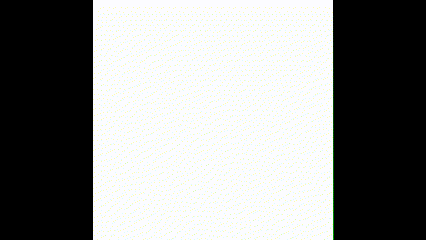

# 🌟 Building an AI Text-to-Video Model from Scratch 🌟

## 🚀 Project Overview
This project showcases the creation of a **Text-to-Video AI Model** using **Generative Adversarial Networks (GANs)**. It demonstrates how textual prompts can be transformed into realistic, dynamic video frames. The model is trained on a custom dataset of videos featuring moving shapes and tested with unseen motions.

<p align="center">
  
</p>

---

## 🎨 Key Features
- **Dynamic Video Generation**: Generate videos of shapes moving in response to text prompts.
- **Custom GAN Architecture**: Combines a Generator and Discriminator for realistic video synthesis.
- **Text Embedding Layer**: Encodes text prompts into embeddings for conditioned generation.
- **Real-World Use Cases**:
  - Generate synthetic videos from textual descriptions.
  - Data augmentation for machine learning.
  - AI-powered creative video tools.

---

## 🏗️ Architecture Overview

### **What is a GAN?**
A **Generative Adversarial Network (GAN)** consists of two neural networks:
- **Generator**: Creates data (e.g., video frames).
- **Discriminator**: Distinguishes between real and fake data.

This adversarial process improves both networks until the generated data is indistinguishable from the real.

<p align="center">
  
</p>

### **How Does it Work?**
1. **Generator** creates video frames from noise + text embeddings.
2. **Discriminator** evaluates authenticity.
3. **Adversarial Training**:
   - Generator tries to fool Discriminator.
   - Discriminator tries to outsmart Generator.

Training continues until both networks reach equilibrium.

---

## 🎬 Dataset & Result
- **Created Videos**: Circles moving in different directions and patterns.
- **Training Prompt Examples**:
  - "circle moving down"
  - "circle moving left"
  - ...and more!
- **Testing Motion** with unseen prompt during training:
  - input prompt: **"circle moving up-right"**
  - output video:



---

## 🛠️ Implementation Highlights

### **Data Pre-Processing**
- Custom PyTorch `Dataset` class to load frames and text prompts.
- Frames normalized and converted into tensors.

### **GAN Components**
- **Generator**: Synthesizes video frames using noise and text embeddings.
- **Discriminator**: Classifies frames as real or generated.
- **Text Embedding Layer**: Encodes text prompts into embeddings for conditioning.

### **Training Process**
- **Adversarial Loss** optimizes both networks.
- Trained over **13 epochs** using **Adam optimizers**.

### **Model Performance**
If being trained for more epochs, the model will generate realistic video frames better based on unseen textual prompts.

---

## 💻 How to Run

### **1. Clone Repository**
```bash
git clone https://github.com/HoDangCao/Text-2-Video
cd Text-2-Video
```

### **2. Install Dependencies**
```bash
pip install -r requirements.txt
```

### **3. Explore `Text2Video.ipynb` file**
- `Text2Video.ipynb` contains comprehensive project manipulation and explaination.

## 📂 Repository Structure
```
├── dataset/                # Created training dataset
├── model/                  # Trained model files
├── Text2Video.ipynb        # Project manipulation and explaination
├── generated_video.avi     # Inference video
├── generated_video.gif     # Inference video in gif format
└── requirements.txt        # Necessary libraries
```

---

## 🌟 Contributing
We welcome contributions! If you have ideas, issues, or want to improve this project:
1. Fork the repository.
2. Create a feature branch: `git checkout -b feature-name`.
3. Submit a pull request.

---

## 🤝 Acknowledgments
Special thanks to the open-source community for inspiration and resources in GAN development.

---

## 📬 Contact
For questions or collaborations, reach out via [dangcaoho151202@gmail.com](mailto:dangcaoho151202@gmail.com).
